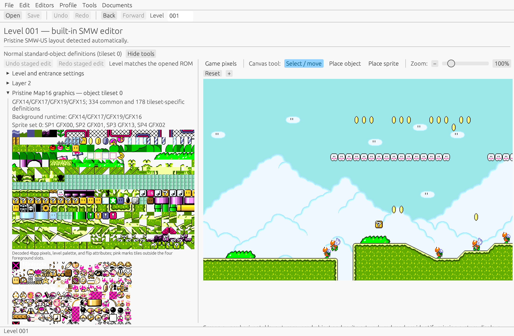
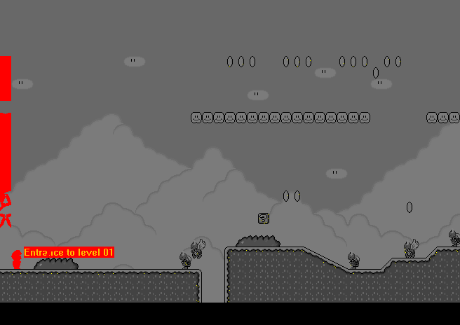

# Illustrated usage guide

This guide covers the current native Rust editor. The application remains under active
development, so keep an untouched source ROM and save experiments to a separate path.

## Open a ROM

Start the application with a ROM path:

```sh
cargo run -p lm-native -- "/path/to/Super Mario World (USA).sfc"
```

Alternatively, start without an argument and choose **File → Open ROM**. After loading, verify the
detected revision and mapper before making changes. Unsupported layouts should produce an explicit
error instead of being treated as vanilla SMW.



The main workspace is divided into two areas:

1. The left panel contains level settings, Layer 2 controls, Map16 graphics, objects, and sprites.
2. The right panel is the independently scrollable level canvas. Its toolbar selects move, object,
   or sprite placement and controls zoom.

The top toolbar provides ROM opening and saving, undo and redo, navigation history, and direct
hexadecimal level selection.

## Navigate and inspect a level

Enter a Lunar Magic level number such as `001` or `105` in the **Level** field. Level numbers are
hexadecimal. Use **Back** and **Forward** to revisit the viewport history.

Use the canvas scrollbars or pointing-device scrolling to traverse the level. The zoom controls
change presentation scale without changing level coordinates. Expand **Level and entrance
settings** to inspect level mode, music, time, scrolling, entrances, and related header fields.

## Select, move, and place content

- Choose **Select / move** to select existing canvas content and drag it.
- Choose **Place object** to insert an object using the active object definition and settings.
- Choose **Place sprite** to insert a sprite using the active sprite definition and settings.
- Use the Map16 browser to inspect the decoded tiles available to the current graphics and palette
  context.

Edits are staged through revision-checked application commands. Use **Undo staged edit** and
**Redo staged edit** for workspace changes, and the main **Undo/Redo** controls for committed
project transactions.

## Save safely

Use **File → Save As** and choose a new ROM path during development. The transaction validates
owned ranges, pointer updates, allocations, and checksum repair before publishing changes. A
failed operation should leave both the ROM and history unchanged.

After saving:

1. Reopen the output in the Rust editor.
2. Test it in an emulator.
3. Retain the source and output hashes when reporting a discrepancy.

## Recover after an interrupted session

While the ROM has committed changes that have not been saved, the native editor maintains a
checksummed recovery record in the platform application-data directory. If the process or machine
stops unexpectedly, the next ordinary launch offers **Recover** or **Discard Recovery**. Recovery
opens the exact unsaved ROM as an unnamed dirty project and restores the active level; use
**File → Save As** to publish it without silently replacing the source ROM.

A normal save or clean close removes the record. This milestone protects changes already committed
to the project ROM. Values still staged inside an open editor form, multi-document recovery, and
undo-history restoration are not yet included.

## Collect compatibility diagnostics

Choose **Help → Compatibility diagnostics…** after opening a ROM. The copyable report contains
the detected game/region/mapper, copier-header and ROM sizes, current identity and checksum health,
unsaved range counts, RATS allocation totals, installed profile audit status, the classified Layer 2
format, and authenticated Map16/Lfix3 runtime generations. Probes that do not apply to the detected
ROM family are labeled `not-applicable`; malformed partial runtimes are warnings rather than guessed
formats.

The report deliberately excludes the ROM path, project name, and ROM bytes. Include it with a bug
report when testing a modified ROM or ecosystem patch.

## Test the current ROM in an emulator

While a level is open, choose **Tools → Test ROM in Emulator…** and select an emulator executable
or macOS application. The editor creates a private snapshot of the current in-memory ROM, including
committed edits that have not been saved to the project path. Review the executable and exact
argument shown in the confirmation window, then choose **Run**. Use **Stop** to terminate the
process; the editor waits for and reaps the process before removing the private ROM.

Installed external-tool configurations whose direct arguments contain `{rom}` appear in a
**Test ROM in Emulator** submenu. Such tools may also use `{level_hex}` or `{level_dec}` to pass
the selected level to an emulator wrapper. A directly chosen emulator receives only the staged ROM
and follows its normal boot path. Direct selected-level injection, live ROM reload, pause, and
single-frame stepping are not implemented yet.

## Rendering validation

The project compares its deterministic renderer with the authenticated Lunar Magic 3.63 editor
surface. The image below is a diagnostic difference visualization for level `$001`: gray regions
agree, while red and annotated regions identify editor-only overlays or pixels requiring
classification.



Generate a local Rust screenshot:

```sh
LM_NATIVE_SCREENSHOT_TO=/tmp/lm-native.png \
  cargo run -p lm-native --features visual-smoke -- \
  --level 001 "/path/to/Super Mario World (USA).sfc"
```

Generate a resumable multi-level contact sheet:

```sh
LM_RENDER_AUDIT_JOBS=8 \
  tools/render-audit.sh /tmp/lm-render-audit \
  "/path/to/Super Mario World (USA).sfc" all 0 game
```

See the [compatibility and differential-test matrix](REIMPLEMENTATION_TEST_MATRIX.md) for the
evidence required before a rendering or editing workflow is considered complete.

## Feature status

The [feature-parity ledger](FEATURE_PARITY_MATRIX.md) distinguishes implemented models from complete
end-user workflows. A feature is not considered passing until its model, transaction, GUI, original
Lunar Magic comparison, and supported format variants have the required evidence.
