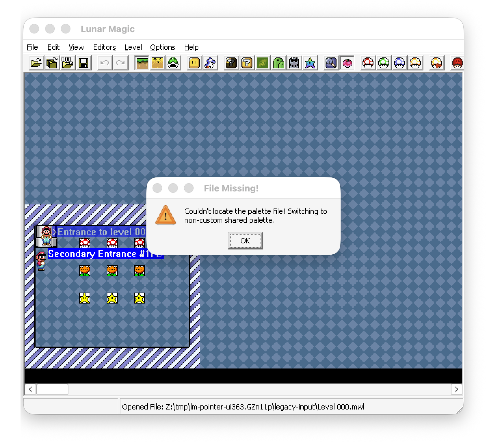
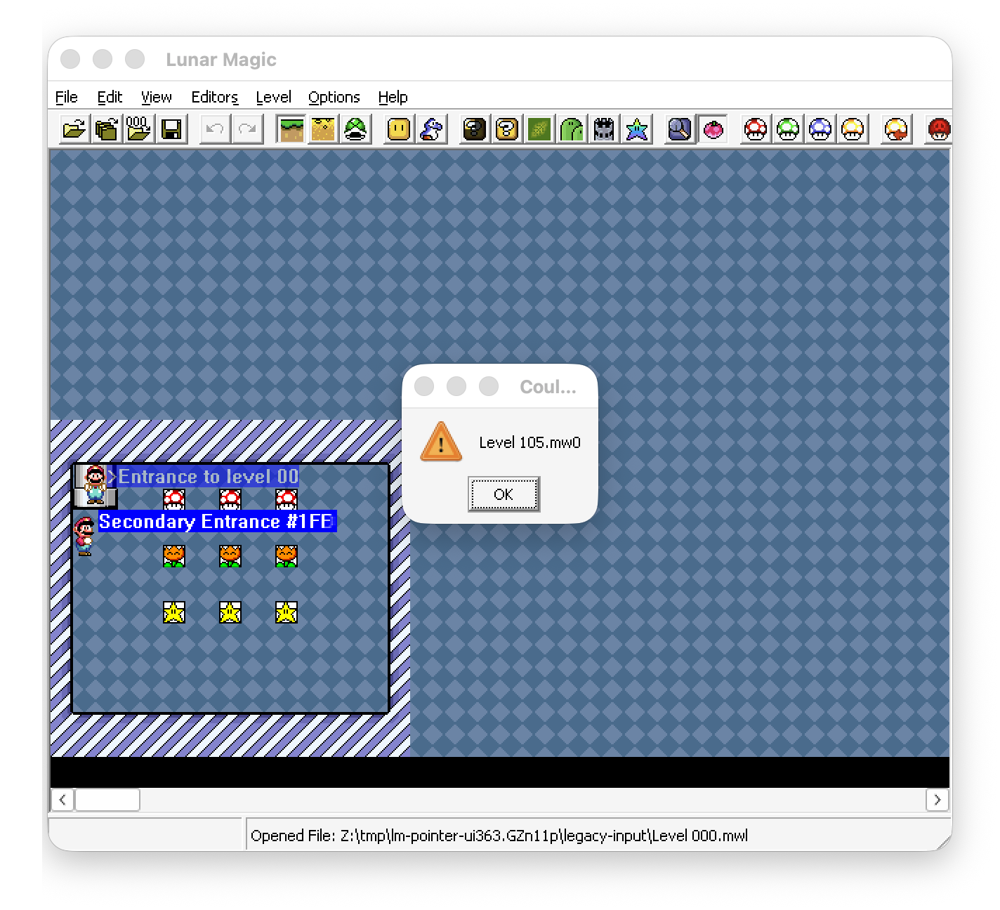

# Lunar Magic 3.63 legacy-import prompt observations

These observations were captured live from an isolated 32-bit `Lunar Magic.exe` 3.63 process under
Wine. The process opened the authenticated `palette-install-positive/after.smc` ROM. Command
`0x238D` opened a level file, and the native file dialog received each fixture path through control
`0x047C`. Top-level dialog titles and child-static text were enumerated directly from the owning
process before accepting the prompt.

The two prompting cases were repeated in a uniquely named Lunar Magic 3.63 process inside an
isolated Wine prefix. macOS captured the complete on-screen Wine window group while each modal was
still active, after the title and child-static text below had been enumerated from the owning Win32
process. `retained_legacy_import_dialog_captures_are_hash_and_structure_bound` verifies each
retained PNG's complete SHA-256 digest, PNG chunk CRCs/order, RGBA format, and 1424-by-1296 capture
dimensions.

## Declared custom palette with missing `.mw3`

Input was the retained `legacy-level-000-custom-palette` five-file bundle with only `Level 000.mw3`
omitted.

```text
title: File Missing!
message: Couldn't locate the palette file! Switching to non-custom shared palette.
button: OK
```

After accepting the prompt, a legacy re-export began its Layer 1 row with flag `00` instead of the
input's `01` and emitted no `.mw3`. This proves the importer continues with the destination shared
palette and clears the custom-palette flag; it does not reject the level.



## Missing required Layer 1, Layer 2, and sprite sidecars

Input was the retained `legacy-level-105` bundle with only `Level 105.mw0` omitted.

```text
title: Couldn't open file!
message: Level 105.mw0
button: OK
```

The run was repeated with only `Level 105.mw1` omitted and then with only `Level 105.mw2` omitted.
Both produced the same title/button with their respective file name as the complete message. The
level was not imported in any case. This distinguishes the optional palette fallback from every
required Layer 1, Layer 2, and sprite sidecar failure.




```text
6067a650c910c7ae151464d6344ebf090b640d7f3f134a2822027047d488bc0f  optional-palette-missing.png
233fd519ca61e3c11446e9cb956e3e5003c7aa35f5e85bb93526097dbb00cf99  required-layer1-missing.png
62135f1c0338572edeb4c59ac003b9965d46fe5823f05fa569ee09fbefc0449c  required-layer2-missing.png
5b6780f05cc60701eb12f44cd903e7a511a30cc115057352f04f01581186130a  required-sprites-missing.png
```

## Present short and overlong palette sidecars

A two-byte `.mw3` containing `00 00` imported without a prompt. Re-export emitted a complete
514-byte `.mw3`: the two supplied bytes replaced the beginning of the destination palette buffer
and the remaining 512 bytes retained the destination level's palette. This includes byte-granular
behavior, so an odd final source byte replaces only half of one SNES color word.

A 515-byte `.mw3` made from the retained authentic payload plus byte `AA` also imported without a
prompt. Re-export was byte-identical to the original 514-byte authentic payload, proving trailing
bytes are ignored.

```text
96a296d224f285c67bee93c30f8a309157f0daa35dc5b87e410b78630a09cfc7  short input mw3
8a50127cc38c0f39120687e3b4c2fa3067ded7dfbddf49c88a1d431003640c8f  short re-export mw3
71071d634be0815a7a74fef8fd973091a532db038355b220a6b6a5f654c6107b  overlong input mw3
43c981cb1409b77459907a2d18d401796eee85f3fe29de030123a10d9afa7a07  overlong re-export mw3
```

## Present short Layer 2 tilemap sidecar

For level 000, the authentic 2,048-byte `.mw1` was replaced by only its first two bytes (`F1 00`).
The file imported without a prompt. A legacy re-export emitted a complete 2,048-byte `.mw1` whose
first two bytes remained `F1 00` and whose remaining 2,046 bytes were zero. This proves that the
legacy importer clears its fixed Layer 2 tilemap workspace, performs a partial read into its
prefix, and retains zeroes for the unread suffix. It does not reject short background sidecars or
merge their suffix with the destination level's background.

```text
079950a589d9712d69c276de82c668764cb30dc8940d56fe01d076b333df29b7  two-byte input mw1
ec8db8ae218504df46a1e6c7b1dc1f6d2a55129f2d836e950e81f22f04281628  2,048-byte re-export mw1
```

An authentic 2,048-byte `.mw1` extended by one zero byte also imported without a prompt. Its
re-export was byte-identical to the authentic 2,048-byte payload, proving that the same fixed
workspace read ignores trailing Layer 2 bytes.

```text
f4bb1b6429b9920e4c59d3f9eb5e58b3f2d0e80aeebf49e1dc845ec45124bf2d  2,049-byte input mw1
67cb940c874127ebca7fdaf0da44e1f683c5040fd36cb746b5222ffd055cfffe  2,048-byte re-export mw1
```

## Layer 1 terminator boundaries

An authentic 33-byte `.mw0` extended by one zero byte imported without a prompt. Its re-export was
the original 33-byte stream, proving bytes after the first `FF` object-stream terminator are
ignored.

Removing only that final `FF` also imported without a prompt. Re-export restored the missing
terminator and was byte-identical to the authentic stream. The Rust compatibility path therefore
supplies a terminator only after parsing reaches the clean end of complete records; it continues
to reject a partial final object record.

```text
4d625c7585d008a646542e01c61baba9fe0b38cb914c279adf34534b8bbd7ca7  34-byte trailing-data input mw0
176cb452f3b71524839f1620f3ab44231e00ae9b5328844f653e4d6e2aab84b7  32-byte unterminated input mw0
38a203f968425a74bce6345426419a5f01e66eb9c5808423f64ab04e088199a8  canonical 33-byte re-export mw0
```

## Standard sprite terminator boundaries

The authentic five-byte standard `.mw2` (`00 70 50 82 FF`) imported without a prompt after one
zero byte was appended. Re-export discarded that trailing byte and reproduced the authentic
stream. Removing only the final `FF` likewise imported without a prompt and re-export restored the
terminator. Rust applies this recovery only after complete standard sprite records; a partial final
record remains invalid.

```text
0cc266211abd9fbdc93088697d972f0a0db3688aec55443e7e3463623dbc0b04  six-byte trailing-data input mw2
6f3e58dbe50babe801916d8b38e3d16b7c0acc2d4260964ccfa498e8264a270e  four-byte unterminated input mw2
640d08e6bc267e92d441e755bbefca1288d3fc3f45f0ef080bd93ddd6e532faf  canonical five-byte re-export mw2
```

## Sprite manifest flag versus stream framing

A synthetic but structurally valid legacy bundle set the manifest sprite flag to `01` and changed
the authentic sprite payload to `20 70 50 82 FF FE`: header bit `$20`, the same complete record,
and expanded termination. Lunar Magic imported it without a prompt. Because no expanded control
was semantically needed, re-export applied its independently verified framing downgrade and wrote
`00 70 50 82 FF`.

Crucially, the re-exported manifest retained sprite flag `01`, and Lunar Magic then imported that
flag-`01` manifest with its standard-header sidecar without a prompt. Thus the legacy manifest flag
is preserved opaque metadata; it does not select the sidecar grammar. Header bit `$20` is the
framing authority. Rust previously treated manifest bit 0 as authoritative and could not import
Lunar Magic's own re-export from this case.

```text
12d58b71af6d889e16d2cb2ad41014322a195065e1271abb2eb98c025916069e  expanded-header input mw2
640d08e6bc267e92d441e755bbefca1288d3fc3f45f0ef080bd93ddd6e532faf  downgraded re-export mw2
ab16204f4cc457889d004d0597cd634f4e916e895ce1f6b4de1c53226910c2a7  flag-01 input manifest
d0623e1a4d729fd504578440729dc11b0cf7cb2786af11ffa5840cbcf8478e4e  flag-01 re-export manifest
```

## Expanded sprite terminator boundaries

The retained expanded baseline `20 FF 02 60 00 47 FF FE` uses a required upper-Y transition, so
Lunar Magic cannot downgrade it to standard framing. Import and re-export retained all eight bytes
exactly.

Removing only `FE` imported without a prompt and restored the complete baseline on re-export.
Removing both final bytes likewise imported without a prompt and restored `FF FE`. Rust therefore
supplies the missing suffix only at these two clean framing boundaries; a partial final record or
malformed control remains invalid.

```text
6f35f278e221522d75d8fe698e1690679d971985be54904c20a0c909dac0e34b  canonical eight-byte expanded mw2
03b1a847544720172a85a9b45938a37c9323c9aba2328f3ebab1276d296d9eec  seven-byte missing-FE input mw2
d85d6890759808af4d739d9b83c6c8ab1634ffd0c80a4c3590ce7dfad4f06008  six-byte missing-pair input mw2
```
